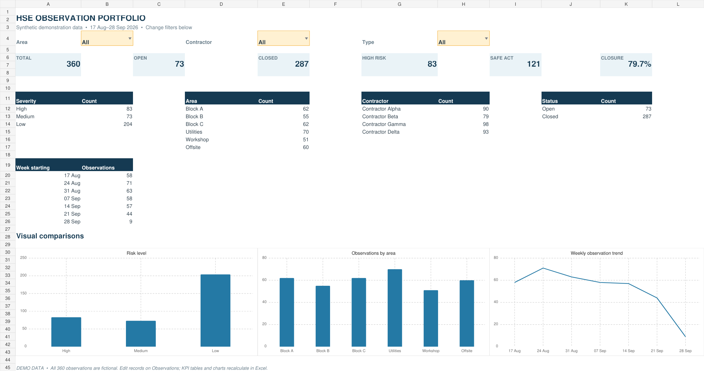

# HSE Observation Dashboard — Excel Portfolio Demo

An interactive safety observation dashboard built in Excel. The workbook uses **360 entirely fictional sample observations** to demonstrate reporting, filtering, and corrective action follow-up. It contains no original workplace records.

## Explore the workbook

[Download the Excel demo](HSE_Observation_Portfolio_Demo.xlsx) and open it in Microsoft Excel. Start on the **Dashboard** sheet, then use the drop-down filters for area, contractor, and observation type. The KPI cards and charts update from the **Observations** table.

The dashboard includes total, open, and closed observations; closure rate; risk mix; area comparison; and a weekly trend. The data sheet contains structured observation descriptions, risk levels, status, and follow-up dates.

## What this demonstrates

- Turning observation logs into useful HSE KPIs and charts.
- Organizing data for filtering, review, and follow-up.
- Designing a clear reporting view for operational discussions.

**Data note:** Every record and organization label in this demo is invented for portfolio use. Results describe the fictional sample only.

## About me

I'm Mohamed Fathy, an HSE Supervisor interested in Excel dashboards, safety observation systems, and practical data workflows. [Connect on LinkedIn](https://www.linkedin.com/in/mohamedfathy-elbadry-8247a920b/).
